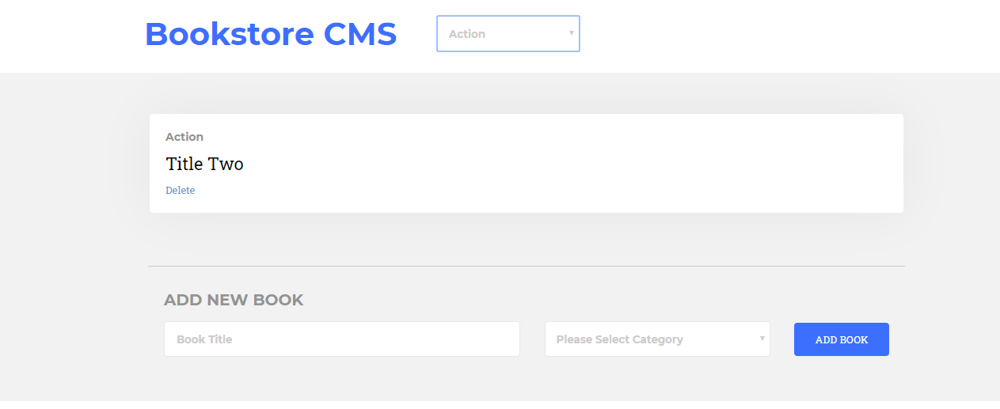

# Bookstore - ReactJS
This project consist of building a simple Bookstore app using ReactJS and Redux

## Technologies used

- ReactJS / Redux
- HTML
- CSS
- Git

## Usage

- git clone https://github.com/fegzycole/react-bookstore.git

- cd react-bookstore

- npm install

- npm start

## Live Demo

[Live Demo Link](https://react-redux-bookstore.herokuapp.com/)

## Testing

- Coming Soon!!

## Authors

👤 **Brham Dev Mahato**

-   Github: [@dev1980](https://github.com/dev1980)
-   Twitter: [@MahatoBrham](https://twitter.com/MahatoBrham)
-   Linkedin: [linkedin](https://www.linkedin.com/in/dev1980/)
-   <brham1980@gmail.com>
-   <https://brhamresume.netlify.com/>

👤 **Ferguson Iyara**

-   Github: [@fegzycole](https://github.com/fegzycole)
-   Twitter: [@FergusonIyara](https://twitter.com/fergusoniyara)
-   Linkedin: [linkedin](https://www.linkedin.com/in/ferguson-iyara/)
-   <fergusoniyara@gmail.com>
-   <https://fegzycole.github.io/Ferguson-Iyara/>

## 🤝 Contributing

Contributions, issues and feature requests are welcome!

Feel free to check the [issues page](https://github.com/dev1980/react-bookstore/issues)

## Show your support

Give a ⭐️ if you like this project!

## 📝 License

This project is [MiT](https://opensource.org/licenses/MIT) licensed.

